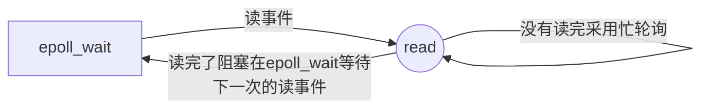

 epoll反应堆模型(libevet核心思想实现)

# EPOLL 事件有两种模型：

## Edge Triggered (ET) 
边缘触发只有数据到来才触发，不管缓存区中是否还有数据。当被监控的文件描述符上有可读写事件发生时，epoll_wait() 会通知处理程序去读写。如果这次没有把数据全部读写完(如读写缓冲区太大)，那么下次调用 epoll_wait() 时，它不会通知你，也就是它只会通知你一次，直到该文件描述符上出现第二次可读写事件才会通知你！这种模式比水平触发效率高，系统不会充斥大量你不关心的就绪文件描述符！
```c
struct epoll_event temp;
temp.data.fd=fd;
temp.events = EPOLLIN | EPOLLET; // ET触发(读事件)
temp.events = EPOLLOUT | EPOLLET; // ET触发(写事件)
epoll_ctl(efd, EPOLL_CTL_ADD, fd, &temp);
 ```


## Level Triggered (LT) 
水平触发只要有数据都会触发（默认就是水平触发）。当被监控的文件描述符上有可读写事件发生时，epoll_wait() 会通知处理程序去读写。如果这次没有把数据一次性全部读写完(如读写缓冲区太小)，那么下次调用 epoll_wait() 时，它还会通知你在上没读写完的文件描述符上继续读写，当然如果你一直不去读写，它会一直通知你！如果系统中有大量你不需要读写的就绪文件描述符，而它们每次都会返回，这样会大大降低处理程序检索自己关心的就绪文件描述符的效率！

```c
struct epoll_event temp;
temp.data.fd=fd;
temp.events = EPOLLIN ; // LT触发(读事件)
temp.events = EPOLLOUT ; // LT触发(写事件)
epoll_ctl(efd, EPOLL_CTL_ADD, fd, &temp);
 ```

# 阻塞与非阻塞
## 阻塞IO
当我们去读一个阻塞的文件描述符时，如果在该文件描述符上没有数据可以读时，那么它会一直阻塞在读文件操作上(会一直卡在那)，直到有数据可以读。当你去往一个文件描述符当中写数据时，当该描述符的没有空间可以写时(缓冲区已满)，他就会阻塞在写操作，直到有空间去进行写操作。以上的读和写我们统一指的是在某个文件描述符进行操作，，不单单指真正的读数据，写数据，还包括接收连接 accept()，发起连接 connect() 等操作……
## 非阻塞IO
当你去读写一个非阻塞的文件描述符时，不管可不可以读写，它都会立即返回，返回成功说明读写操作完成了，返回失败会设置相应 errno 状态码，根据这个 errno 可以进一步执行其他处理。它不会像阻塞 IO 那样，卡在那里不动！

# 对ET和LT模式的对比分析
我们思考步骤如下
假定我们已经把一个用来从管道中读取数据的文件描述符(RFD)添加到 epoll 描述符。
```c
while(1)
{

    （1）   管道的另一端写入了 2KB 的数据

            ......... 

    （2） 调用 epoll_wait(......)
        //调用 epoll_wait，并且它会返（以read函数为例而已）。*回 RFD，说明它已经准备好读取操作

                ........
    （3）   读取 1KB 的数据

                ........

}
```

## epoll ET模式
我们在第一步中向缓冲区中写入了2KB的数据，原本处于挂起状态的epoll_wait()返回RFD，后续对RFD进行读操作，
但我们在这，只读取1KB的数据，剩余的数据还在缓冲区当中，因为是处于ET模式，剩余的数据不会再次触发epoll_wait返回文件句柄，他会再次进入挂起状态，等待下一次数据的读入。这种方式会导致文件缓冲区中的数据越来越多。
 所以我们在使用ET模式时要采用**非阻塞+忙轮询**
*注意单纯的 ET模式 和 LT模式 的效率都没有 ET模式+非阻塞套接字接口 的方式的效率高。不使用非阻塞套接字可能造成死锁现象由 read函数 阻塞的属性造成（以read函数为例而已）。*
ET模式之所以高效是因为可以和减少一些不必要的epoll_wait的触发

如下
```c
#include <stdio.h>
#include <unistd.h>
#include <errno.h>
#include <string.h>
#include <arpa/inet.h>
#include <stdlib.h>
#include <fcntl.h>
#include <ctype.h>
#include "HEAD.h"
#include <sys/epoll.h>
#define SERV_PORT 6665
#define OPEN_MAX 1024

#define EPOLLLEN 1024
#define MAXLEN 10
void sys_error(const void *str)
{
    perror(str);
    exit(1);
}
int main()
{
    int efd, lfd, cfd;
    char buf[BUFSIZ];
    int i, j;
    socklen_t len;
    int ret; //接受返回值
    struct sockaddr_in sev_addr, clt_addr;
    struct epoll_event temp, events[10];
    lfd = socket(AF_INET, SOCK_STREAM, 0);
    int opt;
    setsockopt(lfd, SOL_SOCKET, SO_REUSEADDR, &opt, sizeof(int)); //允许端口复用
    if (lfd == -1)
        sys_error("socket error");
    bzero(&sev_addr, sizeof(sev_addr));
    sev_addr.sin_family = AF_INET;
    sev_addr.sin_port = htons(SERV_PORT);
    sev_addr.sin_addr.s_addr = htonl(INADDR_ANY);
    ret = bind(lfd, (struct sockaddr *)&sev_addr, sizeof(sev_addr));
    if (ret == -1)
        sys_error("bind error");
    ret = listen(lfd, 128);
    if (ret == -1)
        sys_error("listen error");
    efd = epoll_create(10);          //创建监听红黑树
    temp.events = EPOLLIN | EPOLLET; // ET模式
    len = sizeof(clt_addr);
    cfd = accept(lfd, (struct sockaddr *)&clt_addr, &len);
    printf("accept success\n");
    temp.data.fd = cfd;
    epoll_ctl(efd, EPOLL_CTL_ADD, cfd, &temp);
    //设置非阻塞
    int flag;
    flag = fcntl(cfd, F_GETFL);
    flag |= O_NONBLOCK;
    fcntl(cfd, F_SETFL, flag); //设置非阻塞
    while (1)
    {
        int len1;
        ret = epoll_wait(efd, events, 10, -1);
        if (events[0].data.fd == cfd)
        {
            while ((len1 = read(cfd, buf, MAXLEN / 2)) > 0)
            {
                write(1, buf, len1);
            }
        }
    }
    close(lfd);
    close(cfd);
    return 0;
}
```

## epoll LT模式
LT(level triggered)：LT 是缺省的工作方式，并且同时支持 block 和 no-block socket 。当缓冲区数据没有被读完时，epoll_wait()会不断被触发，因此会浪费大量的CPU资源

#  epoll反应堆模型(libevet核心思想实现)
libevent这个库在网络编程和高并发服务器程序开发中的使用非常广泛，并且可以跨平台，是利用上面的epoll+非阻塞方式实现的，并且我们使用了大量的回调函数
在前面，我们所写的服务器对客户端发来数据进行处理后直接写会客户端，但这样的做法时不对的。我们并不能保证，数据每次都已可以写回，客户端使用的是滑动窗口机制，当客户端的缓冲区已经满了，就会发生死锁。epoll 反应堆在接收到客户端的数据后，会把红黑树中值为 fd 的节点去掉，重新设置 fd 的事件为写事件，当接收到客户端的可写时，在进行数据处理和回写。之后在把红黑树中写的这个节点去掉，加上检测读的节点。这样会使程序变得更加的严谨。

epoll 反应堆中描述就绪文件描述符的结构体中有回调函数，这是和之前的就绪文件描述符的结构体所不同的。
代码如下：
```c
#include <stdio.h>
#include <sys/socket.h>
#include <sys/epoll.h>
#include <unistd.h>
#include <stdlib.h>
#include <string.h>
#include <errno.h>
#include <time.h>
#include <fcntl.h>
#include <string.h>
#include <strings.h>
#include <arpa/inet.h>
#define MAX_EVENTS 1024 //监听上限
#define BUFLEN 4096
#define SERV_PORT 8081
void recvdata(int fd, int events, void *arg);
void senddata(int fd, int events, void *arg);
//错误处理函数
void sys_error(const void *str)
{
    perror(str);
    exit(1);
}
//描述就绪文件相关信息
struct myevent_s
{
    int fd;                                           //要监听的文件描述符
    int events;                                       //对应监听事件
    int *arg;                                         //泛型参数
    void (*call_back)(int fd, int events, void *arg); //回调函数
    int status;                                       //是否在监听:1->在红黑树上(监听)，0->不在(监听)
    char buf[BUFLEN];
    int len;
    long last_active; //记录每次加入红黑树g_efd的时间值
};
int g_efd; //全局变量，保存监听红黑树的文件描述符
struct myevent_s g_events[MAX_EVENTS + 1];

//将结构体myevent_s成员变量初始化
void eventset(struct myevent_s *ev, int fd, void (*call_back)(int, int, void *), void *arg)
{
    ev->fd = fd;
    ev->call_back = call_back;
    ev->events = 0;
    ev->arg = arg;
    ev->status = 0;
    if (ev->len <= 0)
    {
        memset(ev->buf, 0, sizeof(ev->buf));
        ev->len = 0;
    }
    ev->last_active = time(NULL); //调用该函数的时间（时间戳）
}

//向监听红黑树上添加一根文件描述符
void eventadd(int efd, int events, struct myevent_s *ev)
{
    struct epoll_event epv = {0, {0}};
    int op;
    epv.data.ptr = ev;
    epv.events = ev->events = events; // EPOLLIN或EPOLLOUT
    if (ev->status == 0)
    {
        op = EPOLL_CTL_ADD; //将其加入红黑树g_efd,并将ststus置1
        ev->status = 1;
    }
    if (epoll_ctl(efd, op, ev->fd, &epv) < 0)
        printf("event add failed [fd=%d],events[%d]\n", ev->fd, events);
    else
        printf("event add OK [fd=%d],op=%d,events[%d]\n", ev->fd, op, events);
    return;
}

//从监听红黑树上摘除一个节点
void eventdel(int efd, struct myevent_s *ev)
{
    struct epoll_event epv = {0, {0}};
    if (ev->status != 1) //不在红黑树上
        return;
    epv.data.ptr = NULL;
    ev->status = 0;
    epoll_ctl(efd, EPOLL_CTL_DEL, ev->fd, &epv);
    return;
}

void senddata(int fd, int events, void *arg)
{
    struct myevent_s *ev = (struct myevent_s *)arg;
    int len;
    len = send(fd, ev->buf, ev->len, 0);
    eventdel(g_efd, ev);
    if (len > 0)
    {
        printf("send[fd=%d],[%d]%s\n", fd, len, ev->buf);
        eventset(ev, fd, recvdata, ev); //设置该fd对应的回调函数为senddata
        eventadd(g_efd, EPOLLIN, ev);   //将fd加入红黑树g_efd中，监听其写事件
    }
    else
    {
        close(ev->fd);
        printf("send[fd=%d] error[%d]:%s\n", fd, errno, strerror(errno));
    }
    return;
}

void recvdata(int fd, int events, void *arg)
{
    struct myevent_s *ev = (struct myevent_s *)arg;
    int len;
    len = recv(fd, ev->buf, sizeof(ev->buf), 0); //读文件描述符，数据存入myevent_s成员buf中
    eventdel(g_efd, ev);                         //将该节点从红黑树上摘除
    if (len > 0)
    {
        ev->len = len;
        ev->buf[len] = '\0';
        printf("recv[%d]:%s\n", fd, ev->buf);
        eventset(ev, fd, senddata, ev); //设置该fd对应的回调函数为senddata
        eventadd(g_efd, EPOLLOUT, ev);  //将fd加入红黑树g_efd中，监听其写事件
    }
    else if (len == 0)
    {
        close(ev->fd);
        // ev-g_events地址相减得到偏移元素
        printf("[fd=%d] pos [%ld],closed\n", fd, ev - g_events);
    }
    else
    {
        close(ev->fd);
        printf("recv[fd=%d] error[%d]:%s\n", fd, errno, strerror(errno));
    }
    return;
}

void acceptconn(int lfd, int events, void *arg)
{
    struct sockaddr_in cin; //客户端的地址结构
    socklen_t len = sizeof(cin);
    int cfd, i;
    if ((cfd = accept(lfd, (struct sockaddr *)&cin, &len)) == -1)
    {
        if (errno != EAGAIN && errno != EINTR)
        {
            sleep(1);
        }
        printf("accept error ,%s\n", strerror(errno));
        return;
    }
    do
    {
        for (i = 0; i < MAX_EVENTS; i++) //从全局数组g_events数组中找到一个空闲位置
        {
            if (g_events[i].status == 0)
                break;
        }
        if (i == MAX_EVENTS)
        {
            printf("max connect linnit[%d]\n", MAX_EVENTS); //已达到连接上限，全局数组已用完
            break;
        }
        int flag = 0;
        if (flag = fcntl(cfd, F_SETFL, O_NONBLOCK) < 0) //将cfd也设置为非阻塞
        {
            printf("fcntl nonblocking failed,%s\n", strerror(errno));
            break;
        }
        //给cfd设置一个myevent_s结构体，回调函数设置为recvdata
        eventset(&g_events[i], cfd, recvdata, &g_events[i]);
        eventadd(g_efd, EPOLLIN, &g_events[i]);
    } while (0);
}

//初始化socket ，初始化lfd
void initlistensocket(int efd, short port)
{
    int ret; //接收返回值
    struct sockaddr_in sin;
    int lfd = socket(AF_INET, SOCK_STREAM, 0);
    if (lfd == -1)
        sys_error("socet error");
    fcntl(lfd, F_SETFL, O_NONBLOCK); //将socket设置为非阻塞
    bzero(&sin, sizeof(sin));
    sin.sin_family = AF_INET;
    sin.sin_port = htons(port);
    sin.sin_addr.s_addr = INADDR_ANY;
    ret = bind(lfd, (struct sockaddr *)&sin, sizeof(sin));
    if (ret == -1)
        sys_error("bind error");
    listen(lfd, 20);
    eventset(&g_events[MAX_EVENTS], lfd, acceptconn, &g_events[MAX_EVENTS]);
    eventadd(efd, EPOLLIN, &g_events[MAX_EVENTS]);
    return;
}

int main(int argc, char *argv[])
{
    unsigned short port = SERV_PORT;
    if (argc == 2) //传入的有参数
        port = atoi(argv[1]);

    g_efd = epoll_create(MAX_EVENTS + 1); //创建监听红黑树
    if (g_efd <= 0)
        printf("creat efd in epoll_creat err %s\n", strerror(errno));
    initlistensocket(g_efd, port);             //初始化监听套接字(将socket ,bind,listn...进行封装)
    struct epoll_event events[MAX_EVENTS + 1]; //保存已经满足就绪事件的文件描述符数组
    printf("server running :port[%d]\n", port);
    int checkpos = 0, i;
    while (1)
    {
        //超时验证，每次测试100个链接，不测试listenfd 当客户端60秒内没有和服务器通信，则关闭此客户端连接
        long now = time(NULL);
        for (i = 0; i < 100; i++, checkpos++)
        {
            if (checkpos == MAX_EVENTS)
                checkpos = 0;
            if (g_events[checkpos].status != 1) //不在红黑树上
                continue;
            long duration = now - g_events[checkpos].last_active; //客户端不活跃的时间
            if (duration >= 60)
            {
                close(g_events[checkpos].fd); //超时关闭与该客户端的链接
                printf("[fd=%d] timeout\n", g_events[checkpos].fd);
                eventdel(g_efd, &g_events[checkpos]); //将该客户端从红黑树g_efd移除
            }
        }
        int nfd = epoll_wait(g_efd, events, MAX_EVENTS + 1, 1000);
        if (nfd < 0)
        {
            printf("epoll_wait error,exit\n");
            break;
        }
        for (i = 0; i < nfd; i++)
        {
            //使用自定义结构体myevent_s类型的指针，接收联合体data的void*ptr成员
            struct myevent_s *ev = (struct myevent_s *)events[i].data.ptr;
            if ((events[i].events & EPOLLIN) && ev->events & EPOLLIN) //读操作就绪
                ev->call_back(ev->fd, events[i].events, ev->arg);
            if ((events[i].events & EPOLLOUT) && ev->events & EPOLLOUT) //写操作就绪
                ev->call_back(ev->fd, events[i].events, ev->arg);
        }
    }
    //退出前释放所有资源
    return 0;
}
```